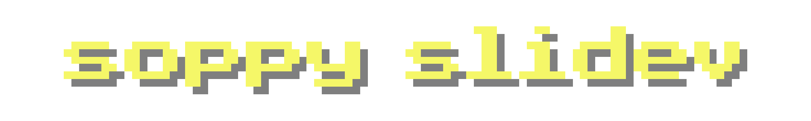

<h1 align="center"></h1>

A pnpm monorepo for building Soppy's [`Slidev`](https://sli.dev) themes, addons, and shared tooling. Everything ships as **raw TS/Vue source** — Slidev compiles it itself, so there is no build step for any package.

## Features

- 🎨 **A branded Slidev theme** — `@soppy-slidev/cqupt`: cover with footer chrome, section progress bar, newsprint overview, campus presets and a MapTiler/Leaflet map.
- 🧩 **A reusable addon** — `@soppy-slidev/addon`: layouts (`rows`, `cols`, `frame`, `jacket`) and components (button, tooltip, carousel, photo/picture/note decor, preview …) driven by shared `--soppy-*` tokens.
- 📦 **Raw-source publish** — no bundling; install the theme, and Slidev loads the `.vue` / `.ts` files directly.
- 🌗 **Light / dark aware** — a single `--soppy-*` primitive set flips with the deck; map tiles follow the theme when the provider supports it.
- 🗂 **Section-aware chrome** — `section:` frontmatter feeds the progress bar and a newsprint overview TOC.

## Playground

The `plays/cqupt` deck demonstrates the pieces, organized into deck `section:` chapters:

| Section      | Highlights                                      |
| ------------ | ----------------------------------------------- |
| `Primitives` | Button, Tooltip/Preview, Carousel               |
| `Decor`      | Rotate, Photo/Picture/Note/Tape/Pin, Viewer     |
| `Campus`     | Campus badge/logo, Jacket + random Scene        |
| `Nav`        | Progress bar, newsprint Overview                |
| `Map`        | Leaflet map, `v-map` markers with skeuo content |

Run it locally:

```bash
pnpm install
pnpm play:cqupt   # dev with HMR
pnpm build:cqupt  # static build into plays/cqupt/dist
```

The built playground is deployed to <https://slidev.soppylzz.com>.

## Installation

Use it in any Slidev deck by installing the theme together with its companion addon:

```bash
pnpm add @soppy-slidev/cqupt @soppy-slidev/addon
```

Then enable both in `slides.md`:

```yaml
---
theme: "@soppy-slidev/cqupt"
addons:
  - "@soppy-slidev/addon"
themeConfig:
  badge: cqupt
  order: arabic
  progress: bottom
---
```

## Packages

| Package | Description |
| --- | --- |
| [`@soppy-slidev/shared`](./packages/shared) | Framework-free kernel: prop grammar, CSS/space normalizers, palette & preset system, seeded pick utils |
| [`@soppy-slidev/addon`](./packages/addon) | The soppy component/layout system (generic, theme-agnostic) |
| [`@soppy-slidev/cqupt`](./packages/cqupt) | The CQUPT-branded theme layer over the addon |

## License

This project is licensed under the [MIT LICENSE](./LICENSE).
